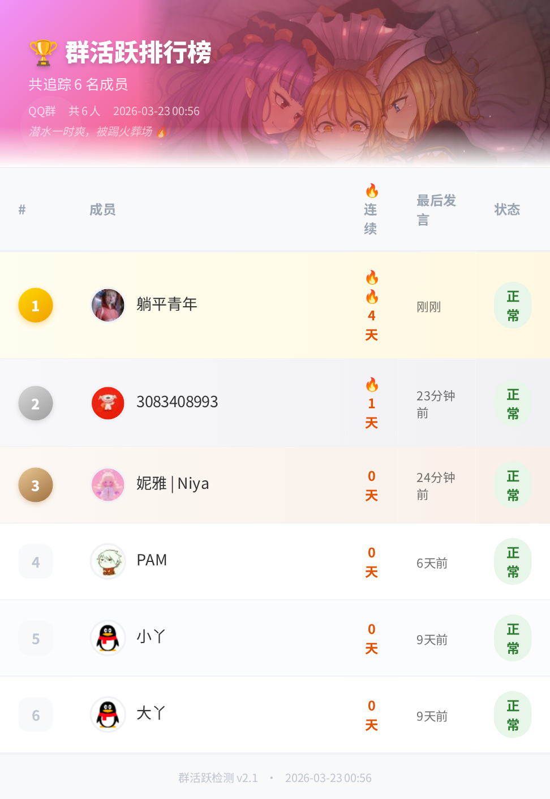
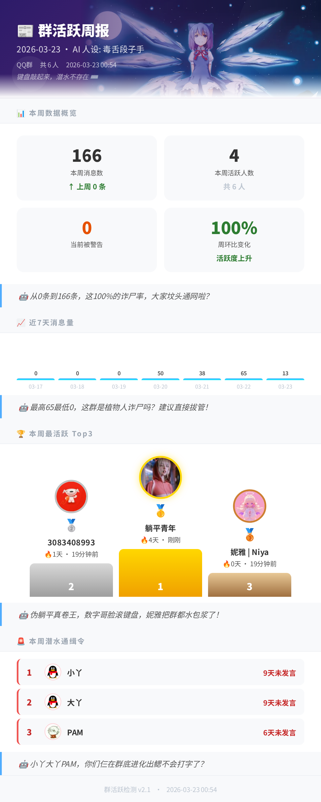
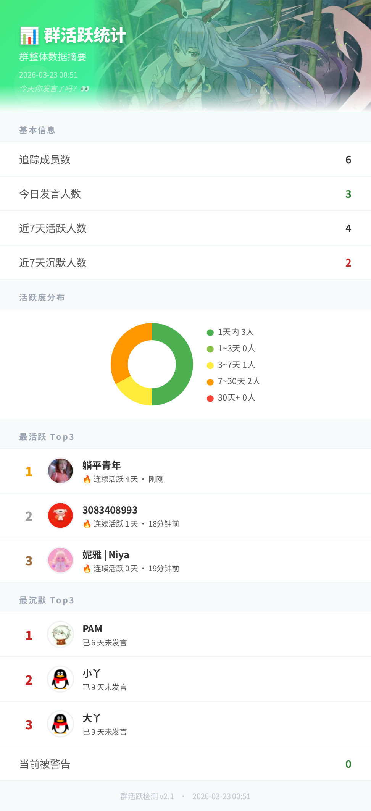

# astrbot_plugin_group_activity

✨ AstrBot 群活跃检测插件 ✨

   

## 📸 示例图

| 活跃排行榜 | AI 图文周报 | 活跃统计 |
|:---:|:---:|:---:|
|  |  |  |

## 🤖 介绍

AI 驱动的 QQ 群活跃管理插件。自动追踪群成员发言活跃度，对长期潜水成员依次发出警告并在超时后踢出。支持 AI 拟人化警告、求生申诉、图文周报、活跃排行榜、时段热力图、打卡签到、群氛围指数、AI 入群欢迎、AI 每日话题等功能。

## 📦 安装

可直接在 AstrBot WebUI → 插件市场 搜索 `astrbot_plugin_group_activity` 安装。

若安装失败，可手动克隆源码：

```bash
cd /AstrBot/data/plugins
git clone https://github.com/cunge98/astrbot_plugin_group_activity
# 然后在 AstrBot 控制台重启
```

## 📌 使用前须知

- 仅支持 **QQ 平台**（aiocqhttp / OneBot v11 协议）
- 图文功能需要 AstrBot 已配置 **Playwright 文转图服务**
- AI 功能需要已配置至少一个 **LLM 提供商**
- 机器人需要**群管理员权限**才能执行踢人操作
- 首次使用建议执行 `/初始化活跃数据` 同步群成员数据

## 🔄 工作流程

```
定时检测（每 N 分钟）
    ↓
拉取最新群成员列表
    ↓
对比历史数据
  ├─ 新成员 → 写入档案，1 小时内入群者加入待欢迎队列
  ├─ 重新入群 → 加入待欢迎队列，重置警告状态
  └─ 离群成员 → 从档案中清除
    ↓
遍历所有成员
  ├─ 新成员宽限期内 → 跳过
  ├─ 管理员/群主（exclude_admins=True）→ 跳过
  ├─ 不活跃超过阈值 → 发送警告
  └─ 警告后超出踢出时限且仍未发言 → 踢出

成员首次发言（on_msg）
    ↓
  ├─ 更新活跃时间、连续活跃天数
  ├─ 新成员 / 待欢迎队列 → 触发 AI 入群欢迎（异步）
  ├─ 连续打卡里程碑（7/14/30 天）→ 群内贺电（异步）
  └─ 被警告者 @Bot → AI 申诉审判
```

## 🎮 命令列表

### 普通成员

| 命令 | 说明 |
|------|------|
| `/活跃排行` | 群活跃排行榜（QQ 头像 + 连续活跃天数） |
| `/活跃查询` | 查询自己的活跃状态和安全评级 |
| `/活跃趋势` | 近 14 天每日消息量折线柱状图 |
| `/活跃统计` | 群整体统计（圆环图 + Top3 头像） |
| `/活跃热力图` | 近 14 天 24 小时发言分布热力图 |
| `/打卡榜` | 今日打卡排行（首次发言顺序 + 连续称号） |
| `/群氛围` | 群氛围健康指数（近 7/14 天走势 + AI 建议） |
| `/活跃帮助` | 显示功能帮助页 |

### 管理员

| 命令 | 说明 |
|------|------|
| `/活跃检测` | 查看当前运行状态和关键配置 |
| `/不活跃列表` | 列出所有超过不活跃阈值的成员 |
| `/手动检测` | 立即执行一次活跃检测（不等待定时器） |
| `/初始化活跃数据` | 从平台拉取最新群成员数据并写入档案 |
| `/清除警告 [QQ号]` | 清除指定成员的警告/踢出状态 |
| `/群周报` | 手动生成本周 AI 图文周报 |
| `/群氛围` | 同普通成员，管理员可在任意群触发 |
| `@Bot + 理由` | （被警告者）向 AI 发起求生申诉 |

## ⚙️ 配置说明

所有配置项在 AstrBot WebUI → 插件管理 → 群活跃检测 中修改，无需重启。

### 基础设置

| 配置项 | 说明 | 默认值 |
|--------|------|--------|
| `enabled` | 全局开关，关闭后所有定时任务暂停 | 关闭 |
| `whitelist_groups` | 仅在这些群执行检测（留空 = 全部群） | 空 |
| `blacklist_groups` | 永不检测的群（优先级高于白名单） | 空 |
| `check_interval_minutes` | 定时检测间隔（分钟） | 1 |
| `theme` | 图片主题：清新蓝 / 活力橙 / 优雅紫 / 暗夜模式 | 清新蓝 |
| `rank_count` | 排行榜最多显示人数 | 20 |

### 活跃检测与踢人

| 配置项 | 说明 | 默认值 |
|--------|------|--------|
| `inactive_days` | 超过该天数未发言则触发警告 | 7 |
| `kick_hours` | 警告后多少小时未响应则踢出 | 24 |
| `new_member_grace_days` | 新成员入群后的宽限期（天），期间不检测 | 3 |
| `exclude_admins` | 管理员/群主豁免检测 | 是 |
| `kick_message` | 踢出时的群通知模板，支持 `{nickname}` `{days}` | 默认文案 |

### AI 功能

| 配置项 | 说明 | 默认值 |
|--------|------|--------|
| `ai_enabled` | 启用 AI 文案生成（警告/申诉/周报/欢迎/话题） | 关闭 |
| `ai_provider` | 指定使用的 LLM 提供商 ID，留空使用默认 | 空 |
| `ai_style` | AI 人设：傲娇萌妹 / 严苛群管 / 毒舌段子手 / 古风仙人 / 热血解说员 | 傲娇萌妹 |
| `ai_custom_prompt` | 自定义人设 Prompt，填写后覆盖 `ai_style` | 空 |
| `ai_appeal` | 允许被警告者 @Bot 发起 AI 申诉 | 关闭 |

### AI 入群欢迎

| 配置项 | 说明 | 默认值 |
|--------|------|--------|
| `ai_welcome` | 新成员首次发言时自动发送欢迎语 | 关闭 |
| `welcome_style` | 欢迎语风格：AI生成 / 活力热血 / 古风雅致 / 简洁清爽 / 自定义 | AI生成 |
| `welcome_message` | 自定义欢迎语模板，支持 `{nickname}`，仅在风格为「自定义」时生效 | 默认文案 |

> **说明**：`welcome_style=AI生成` 时需同时开启 `ai_enabled`，否则自动降级为「简洁清爽」模板。AI 欢迎语会读取新成员的第一句话和群名，生成个性化破冰内容，生成超时（20 秒）时自动降级。

### 自动周报

| 配置项 | 说明 | 默认值 |
|--------|------|--------|
| `auto_weekly` | 每周定时自动发送图文周报 | 关闭 |
| `auto_weekly_day` | 发送星期：周一 至 周日 | 周日 |
| `auto_weekly_time` | 发送时间（HH:MM 格式） | 20:00 |

### AI 每日话题

| 配置项 | 说明 | 默认值 |
|--------|------|--------|
| `auto_topic` | 每天自动发送 AI 生成的群话题（需开启 `ai_enabled`） | 关闭 |
| `auto_topic_day` | 发送频率：每天 / 周一 至 周日 | 每天 |
| `auto_topic_time` | 发送时间（HH:MM 格式） | 09:00 |

## 🤖 AI 功能详解

### 警告文案

开启 `ai_enabled` 后，警告通知由 AI 根据当前人设生成，内容包含不活跃天数、踢出倒计时，语气风格随人设变化。关闭时使用系统默认模板。

### 求生申诉

开启 `ai_appeal` 后，被警告的成员可在**任意频道**发送 `@Bot + 申诉理由`。AI 扮演"群活跃法庭"对理由进行审判，并返回是否获得豁免。获免后当次警告被清除；驳回则倒计时继续。

### AI 入群欢迎

触发时机：
1. 新成员**首次在群内发言**时（`on_msg` 检测到未知成员）
2. 定时检测（`_check`）发现**近 1 小时内入群**的新成员，在其首次发言时触发
3. **重新入群**的成员（曾被踢后再次加入）首次发言时触发

欢迎流程：Bot @该成员，发送欢迎语（AI 生成时还会针对其第一句话进行破冰）。

### 群氛围指数 (`/群氛围`)

分析近 14 天消息走势，计算 7 个维度信号：

| 信号 | 说明 |
|------|------|
| 全员沉默 | 近 7 天所有成员 0 发言 |
| 急剧下滑 | 近 7 天较前 7 天下降 ≥ 50% |
| 气氛活跃 | 近 7 天较前 7 天上升 ≥ 30% |
| 话题爆发 | 近 7 天单日最大峰值 ≥ 均值 3 倍 |
| 沉默比过高 | 近 7 天无发言成员 ≥ 60% |
| 健康 | 7 天均有发言 + 波动在 20% 内 |
| 一般 | 不满足以上任一特殊条件 |

AI 建议在图片中渲染，根据信号给出具体改善建议。

### 打卡里程碑

连续活跃天数达到 **7 / 14 / 30** 天时，Bot 在群内自动发送贺电。
里程碑称号体系：

| 连续天数 | 称号 |
|----------|------|
| 1–6 天   | 🌱 新萌 |
| 7–13 天  | 🌿 活跃中 |
| 14–29 天 | 🥈 银牌常客 |
| 30–89 天 | 🥇 金牌驻场 |
| 90+ 天   | 👑 传奇守护者 |

## 💾 数据存储

插件数据保存在 `AstrBot/data/astrbot_plugin_group_activity/activity_data.json`，采用防抖写入策略（最少 30 秒写一次），避免频繁 I/O。

数据会自动清理 60 天前的每日/小时统计，打卡记录保留 30 天。

## 🗂 项目结构

```
astrbot_plugin_group_activity/
├── main.py              # 插件主体逻辑
├── templates.py         # 所有 HTML/Jinja2 渲染模板
├── _conf_schema.json    # WebUI 配置项定义
├── tests/               # 单元测试（pytest）
│   ├── conftest.py
│   ├── helpers.py
│   ├── test_check_logic.py
│   ├── test_welcome.py
│   ├── test_vibe.py
│   ├── test_checkin.py
│   ├── test_heatmap.py
│   ├── test_score.py
│   ├── test_daily_topic.py
│   └── test_templates.py
└── docs/
    ├── rank.png
    ├── weekly.png
    └── stats.png
```

## ❓ 常见问题

**Q：为什么新成员进群没有收到欢迎语？**
A：欢迎语在新成员**首次发言**时触发，而非入群瞬间。请确认已开启 `ai_welcome`，且 Bot 有发言权限。

**Q：AI 欢迎语一直用固定模板，没有 AI 生成的内容？**
A：检查 `ai_enabled` 是否开启，且 `welcome_style` 已选择「AI生成」。AI 生成超时（>20 秒）会自动降级为固定模板。

**Q：手动检测没有反应？**
A：需要 Bot 能调用 `get_group_member_list`（OneBot v11），确认 Bot 在群内且有获取成员列表的权限。

**Q：排行榜/统计图片显示空白或报错？**
A：需要 AstrBot 已正确配置 Playwright 文转图服务，检查 AstrBot 日志获取详细错误信息。

**Q：自动周报没有按时发送？**
A：确认 `auto_weekly` 已开启，`auto_weekly_day` 和 `auto_weekly_time` 配置正确（时间格式 `HH:MM`），且 Bot 保持在线。

**Q：管理员也被警告了？**
A：将 `exclude_admins` 设为 `True`，或将该成员加入白名单群。

## 📝 更新日志

### v2.3.0
- **群氛围指数**：`/群氛围` 命令，7 维信号评估 + 14 天柱状走势图 + AI 改善建议
- **AI 入群欢迎超时保护**：AI 生成超过 20 秒自动降级为固定模板，不再阻塞
- **新成员欢迎检测修复**：`_check()` 先于首次发言运行时不再错过欢迎触发
- **代码审查 Bug 修复**：
  - `_save()` 防抖逻辑：写入失败时确保脏标志持续保留，不丢失数据
  - `_dur()` 负数保护：修复时间戳异常时除法崩溃
  - `_check()` 新成员字段补全：`streak` 和 `last_active_date` 字段缺失修复
  - `_check()` 群初始化补全：`daily_stats`/`hourly_stats`/`daily_checkins` 缺失修复

### v2.2.0
- **活跃时段热力图**：`/活跃热力图` 近 14 天 24 小时发言热力图
- **打卡签到**：`/打卡榜` 今日打卡排行 + 连续活跃称号体系 + 里程碑贺电
- **AI 入群欢迎**：新成员首次发言触发，5 种风格，AI 模式可接话/调侃第一句话
- **图表升级**：趋势图改为 SVG 折线柱状图，数值清晰可读
- **周报修复**：离群成员不再出现在排行中
- 检测间隔默认值改为 1 分钟

### v2.1.0
- 周报升级为图文混排（数据卡片 + 柱状图 + Top3 + AI 短评）
- 排行榜 QQ 头像、前三名高亮
- 个人查询火焰徽章（连续活跃天数）
- 活跃统计圆环分布图

### v2.0.0
- 全新 Playwright 高清渲染
- AI 拟人化警告、求生审判、群周报
- 4 套主题配色、活跃趋势图
- 连续活跃天数、定时自动周报
- 自定义 AI 人设

### v1.0.0
- 基础活跃检测、警告、踢出
- 排行榜、个人查询、白/黑名单
